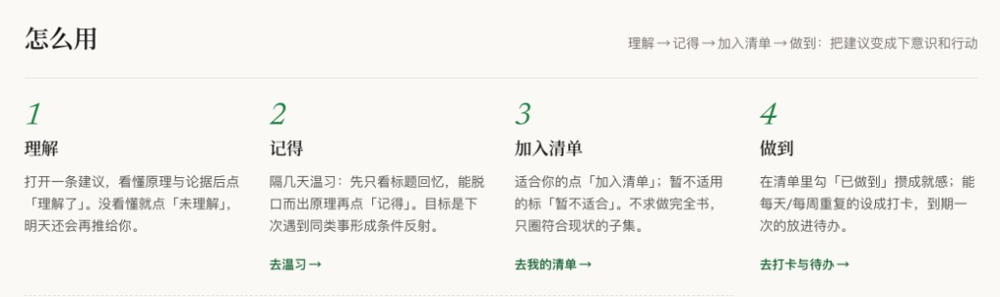

# 高性价比人生指南 · How To Live Better — 开源镜像与衍生站点

[](./LICENSE) [](https://github.com/eternity4719/HowToLiveBetter) [](https://astro.build)

> 🌐 **在线体验（免安装、手机可用）**：[**how2livebetter.net**](https://how2livebetter.net) — 630 条高性价比建议 · 处境体检 · 打卡与间隔复习

## 原始项目

本仓库的源头是 [eternity4719/HowToLiveBetter](https://github.com/eternity4719/HowToLiveBetter)（《高性价比人生指南》，内容遵循 CC BY 4.0）：

- 34 个章节 / 630 条「高性价比行动建议」，每条包含 6 个字段：成本、说人话、收益、证据等级（A/B/C 三级）、文献来源、备注
- 收录 1340 条文献链接、333 处条目互引，27 条诚实标注 TODO(待核实)
- 标签体系：按 钱 / 时间 / 毅力 / 收益 四个维度标注每条建议的实施门槛

原始项目以 Markdown 形式维护，是一个「读」的项目。本仓库则把它做成了一个「用」的产品。

## 本项目的功能扩展

在原始数据之上，我们构建了完整的数据管道与一个静态站点（线上版本：[how2livebetter.net](https://how2livebetter.net)）：

**结构化数据管道**

- 解析器将上游 Markdown 解析为结构化数据（`items.json`），每条建议获得**位置无关的稳定 key**，上游增删条目不会导致引用漂移
- 为全部 630 条建议生成**搜索意图 slug**（`/q/<slug>/` 页面），覆盖真实搜索场景

**静态站点（Astro 构建，688 页全静态）**

- 📖 **章节浏览** — [34 章按原书结构呈现](https://how2livebetter.net/chapters/)，纸感出版风设计
- 🩺 **处境体检**（[/tools/assess/](https://how2livebetter.net/tools/assess/)）— 问卷 + 匹配引擎 + 打分公式，根据你的处境（预算/时间/毅力）推荐最值得先做的建议
- 🎯 **阶段策展**（[/stages/](https://how2livebetter.net/stages/)）— 按人生阶段（如高中、大学、职场）精选与排序
- ⏰ **场景清单**（[/moments/](https://how2livebetter.net/moments/)）— 8 个关键时刻（如月末、搬家、换季）的行动顺序清单
- 📝 **打卡与复习**（[/tools/checkin/](https://how2livebetter.net/tools/checkin/)）— 本地存储的每日打卡（连续天数）与间隔重复（SRS）复习；条目标记收藏见 [/tools/saved/](https://how2livebetter.net/tools/saved/)
- 🔍 **SEO 基建** — sitemap、JSON-LD 结构化数据、OG 图、`llms.txt`（对 AI 搜索引擎友好）

**衍生产品**

- 📱 微信小程序（数据包由同一管道生成）
- 🧩 浏览器插件（离线速查同一份结构化数据）

> 仓库内 `dist/` 为站点构建产物的自动同步快照，**请勿直接修改**；上游更新后由私有源码仓的同步脚本重新生成（commit 信息中的 `livebetter@<hash>` 标注了对应的源码版本）。

## 怎么用

理解 → 记得 → 加入清单 → 做到：把建议变成下意识和行动。



| 步骤 | 做法 |
|---|---|
| **1 · 理解** | 打开一条建议，看懂原理与论据后点「理解了」；没看懂就点「未理解」，明天还会再推给你 |
| **2 · 记得** | 隔几天温习：先只看标题回忆，能脱口而出原理再点「记得」。目标是下次遇到同类事形成条件反射 → [去温习](https://how2livebetter.net/tools/checkin/?tab=review) |
| **3 · 加入清单** | 适合你的点「加入清单」；暂不适用的标「暂不适合」。不求做完全书，只圈符合现状的子集 |
| **4 · 做到** | 在清单里勾「已做到」攒成就；能每天/每周重复的设成打卡，到期一次的放进待办 → [去打卡与待办](https://how2livebetter.net/tools/checkin/) |

不知道从哪条开始？先[选人生阶段](https://how2livebetter.net/stages/)或做[处境体检 · 16 题](https://how2livebetter.net/tools/assess/)，筛出和你有关的几十条，再按上面四步推进。

## 本地运行

无需安装任何依赖，只需 Node.js ≥ 18：

```bash
git clone https://github.com/marsbuildlog/how-2-live-better.git
cd how-2-live-better
npm start          # 即 node server.mjs
```

然后访问 <http://localhost:4780/>。自定义端口：

```bash
PORT=8080 npm start
```

也可以用任何静态服务器指向 `dist/`，例如：

```bash
npx serve dist
python3 -m http.server 8000 --directory dist
```

## 目录结构

```
├── dist/        # 站点构建产物 (纯静态 HTML/CSS/JS)
├── server.mjs   # 零依赖本地预览服务器 (目录重定向 / 自定义 404 / 穿越防护)
└── package.json # npm start 入口
```

## License

- **代码部分**（`server.mjs`、`package.json` 等脚手架）：[MIT License](./LICENSE)
- **站点内容**（`dist/` 内的文章、题库、数据）：源自 [eternity4719/HowToLiveBetter](https://github.com/eternity4719/HowToLiveBetter)，遵循 **CC BY 4.0**，使用时请署名原作者并注明非官方衍生作品

---

如果这套东西对你有帮助，欢迎 **⭐ Star** 支持一下，并到 [**how2livebetter.net**](https://how2livebetter.net) 开始实践你的第一条建议。